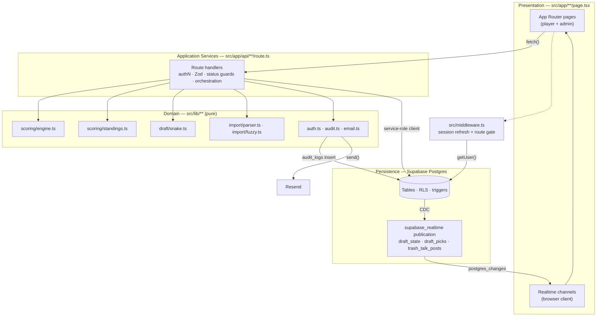

# CFP War Chest — System Architecture

CFP War Chest is a private, season-long college-football futures draft game (3–6 players,
commissioner-run). This document describes how the system is layered, how a request flows
through it, and the cross-cutting concerns — authentication, Row-Level Security, the
config-driven scoring engine, the snake draft with Supabase Realtime, results import with
fuzzy name matching, and audit logging.

## Stack at a glance

| Concern            | Technology |
| ------------------ | ---------- |
| Framework          | Next.js 16 (App Router, TypeScript, Turbopack) on Vercel |
| Database / Auth    | Supabase — Postgres, magic-link Auth, Realtime CDC |
| Transactional mail | Resend (`src/lib/email.ts`) |
| UI                 | Tailwind + Radix UI |
| Validation         | Zod (route-handler request bodies) |
| Import parsing     | papaparse (CSV) + SheetJS/`xlsx` (XLSX) |
| Fuzzy matching     | fuse.js |

---

## 1. Layered architecture

The codebase is organized into four layers with a strict inward dependency direction:
presentation → application services → domain → persistence. The domain layer is pure and
has no knowledge of HTTP, Supabase, or React.

### Presentation — App Router pages (`src/app/**/page.tsx`, `layout.tsx`)
React Server/Client Components under `src/app`. Player-facing routes live under
`src/app/leagues/[leagueId]/*` (`draft`, `draft-board`, `standings`, `trash-talk`,
`war-chest`); commissioner routes under `src/app/admin/leagues/[leagueId]/*`
(`draft-control`, `draft-setup`, `import`, `audit`). Client components call the API routes
over `fetch` and, for live views, open Supabase Realtime channels directly with the
browser client (`src/lib/supabase/client.ts`). The 2026 admin scoring-config screen is
`src/app/admin/leagues/[leagueId]/draft-setup/page.tsx`.

### Application services — route handlers (`src/app/api/**/route.ts`)
Each `route.ts` is the transactional boundary: it authenticates the caller, validates the
body with Zod, enforces league-status guards, orchestrates domain functions, reads/writes
Postgres through the Supabase **service-role** client, and writes audit entries. Handlers
are the *only* place that touches both HTTP and the database. Notable routes:

- `POST /api/auth/bootstrap` — one-time initial-admin creation from env vars.
- `POST /api/auth/invite` — admin invites a player (creates auth user + profile + membership, emails a magic link).
- `GET /api/auth/me` — current session profile.
- `POST /api/admin/leagues/[leagueId]/draft` — draft control: `lock_pool`, `set_order`, `start`, `pause`, `resume`, `undo`, `skip`, `override`, `complete`.
- `POST /api/admin/leagues/[leagueId]/import` — preseason pool CSV/XLSX import.
- `POST /api/admin/leagues/[leagueId]/results` — results upload / match / publish (drives scoring).
- `GET|PATCH /api/admin/leagues/[leagueId]/scoring` — read/edit scoring configs + pick counts (pre-lock only).
- `POST|GET /api/leagues/[leagueId]/draft` — player pick submission + draft snapshot.
- `GET /api/leagues/[leagueId]/standings` — computed leaderboard.
- `GET|POST|DELETE /api/leagues/[leagueId]/trash-talk` — league chat.

### Domain — pure logic (`src/lib/**`)
Deterministic, framework-free modules that take plain inputs and return plain outputs:

- `src/lib/scoring/engine.ts` — `calculateScore()` + the seeded `DEFAULT_SCORING_CONFIGS`.
- `src/lib/scoring/standings.ts` — `buildStandings()` aggregation + tie-breaking.
- `src/lib/draft/snake.ts` — `generateSnakeOrder()` / `getCurrentDrafter()`.
- `src/lib/import/parser.ts` — CSV/XLSX parsing, header normalization, per-category validation.
- `src/lib/import/fuzzy.ts` — `findMatches()` exact + fuse.js fuzzy name matching.
- `src/lib/auth.ts` — session/role guards (`requireAdmin`, `requireLeagueMember`, …).
- `src/lib/audit.ts`, `src/lib/email.ts` — audit-log writer and Resend templates.
- `src/types/database.ts` — the `Category` union and all row/DTO types.

### Persistence — Supabase Postgres (`supabase/migrations/**`)
Schema, indexes, RLS policies, Realtime publication, and `updated_at` triggers.
Migration `001` defines the schema + RLS; `002` seeds sample data; `003` adds the
`most_improved` / `disaster_draft` categories, the `preseason_win_total` column, and widens
the category `CHECK` constraints. The domain layer never imports a Supabase client — it
receives already-fetched rows from the handler and returns values the handler persists.

---

## 2. Request lifecycle

1. **Middleware (`src/middleware.ts` → `src/lib/supabase/middleware.ts`).** Every non-asset
   request (see the `matcher`) runs `updateSession()`. It builds a server client bound to
   request/response cookies, calls `supabase.auth.getUser()` to refresh the session, allows
   an allow-list of public routes (`/`, `/login`, `/login/verify`, `/auth/callback`), and
   redirects unauthenticated users to `/login?redirectTo=<path>`. Refreshed auth cookies are
   written onto the outgoing response.
2. **Page render or API dispatch.** Server Components and route handlers build their own
   request-scoped clients via `src/lib/supabase/server.ts` — `createClient()` (anon key,
   respects RLS as the logged-in user) or `createServiceClient()` (service-role key, bypasses
   RLS).
3. **Handler work.** Authenticate (`requireAdmin` / `requireLeagueMember` / `requireAuth`),
   validate the body with Zod (`422` on failure), enforce a league-status guard (`409` when
   the action isn't allowed for the current lifecycle state), call domain functions, persist
   through the service-role client, and write an audit entry.
4. **Realtime fan-out.** Writes to `draft_state`, `draft_picks`, or `trash_talk_posts` are
   captured by Postgres CDC and pushed to subscribed browser clients, which re-fetch.
5. **Side effects.** Email (Resend) is fired-and-forgotten with `.catch(console.error)` so a
   mail failure never blocks the response.

League lifecycle statuses gate what handlers accept:
`setup → data_imported → draft_ready → drafting → drafted → scoring → completed`.
Imports are rejected once `drafting`+; scoring config edits require
`setup | data_imported | draft_ready`; `lock_pool` flips entities/configs to `locked` and is
irreversible.

---

## 3. Authentication model

- **Magic link via Supabase Auth.** There are no passwords. `POST /api/auth/invite`
  (admin-only) creates the auth user + `public.users` profile + `league_members` row and
  emails a login link (`src/lib/email.ts`). The initial commissioner is bootstrapped once via
  `POST /api/auth/bootstrap` from `BOOTSTRAP_ADMIN_*` env vars (refuses if any admin already
  exists).
- **Callback.** `GET /auth/callback` exchanges the `code` for a session
  (`exchangeCodeForSession`) and redirects to `redirectTo` (default `/leagues`).
- **Session refresh.** `src/middleware.ts` keeps the session/cookies fresh on every request
  and gates private routes (see §2).
- **Server-side guards (`src/lib/auth.ts`).** All are async and return the `User` profile or
  `null`:
  - `getSessionUser()` — resolves `auth.getUser()` then joins the `users` profile row.
  - `requireAuth()` — any authenticated user.
  - `requireAdmin()` — user with `role === 'admin'`; handlers return `401` otherwise.
  - `requireLeagueMember(leagueId)` — verifies a `league_members` row for `(leagueId, user)`
    before returning the profile; the standard gate for player-facing league reads.

Two subject types matter downstream: the **logged-in user** (via the anon client, subject to
RLS) and the **service role** (via `createServiceClient()`, which bypasses RLS). Handlers do
their own authorization with the guards above and then use the service-role client to perform
the write, so authorization is enforced in application code, not delegated to RLS.

---

## 4. Row-Level Security strategy

RLS is enabled on every table (migration `001`). Policies fall into three families:

- **`*_service_all` — `auth.role() = 'service_role'`.** A full-access escape hatch for the
  server. Because route handlers run privileged multi-row orchestration (advancing draft
  state, upserting scores, writing audit logs) they use the service-role client, which these
  policies admit unconditionally.
- **Member read — `exists (select 1 from league_members lm where lm.league_id = <row> and
  lm.user_id = auth.uid())`.** League-scoped visibility for `leagues`, `league_members`,
  `draftable_entities`, `draft_segments`, `draft_picks`, `draft_state`, `scoring_configs`,
  `trash_talk_posts`. A user only sees rows for leagues they belong to.
- **Admin write — `exists (select 1 from users u where u.id = auth.uid() and u.role =
  'admin')`.** Grants `for all` to commissioners on configuration/content tables.

Table-specific nuances:

- **`scores`** has *two* member-read policies. `scores_member_read_published` requires
  `published = true`; `scores_member_read_provisional` also permits reads when the league's
  `settings_json->>'allow_provisional_visibility'` is `true`. Provisional (unpublished) scores
  stay hidden by default until the commissioner publishes.
- **`trash_talk_posts`** carries fine-grained per-actor policies: members read only
  non-deleted rows, may insert only their own (`user_id = auth.uid()`), and may soft-delete
  (`update`) only their own; admins get `for all`.
- **`audit_logs`** is admin-read + service-all only — never exposed to players.

The `service_role` key lives server-side only (`SUPABASE_SERVICE_ROLE_KEY`); the browser
client uses the anon key, so client-initiated Realtime reads remain fully constrained by the
member/admin policies above.

---

## 5. Config-driven scoring engine

The engine (`src/lib/scoring/engine.ts`) reads every rule from `scoring_configs` rows stored
per `(league_id, category)`; it hard-codes no point values. `calculateScore(pick, config,
context)` dispatches on `config.formula` and returns a `CalculationDetail` — the points plus a
human-readable `formula` string and all inputs, so the UI can show a full breakdown without
recomputing.

Four formulas (the `ScoringFormula` union):

- **`multiplier_odds_ratio`** (Heisman, CFP, Conference Champion) —
  `multiplier × (locked_odds / lowest_drafted_odds_in_scope)`. The "lowest drafted odds"
  denominator comes from the `ScoringContext` pool for the category (or, for
  `conference_champion`, from the per-conference pool), rewarding longer-shot picks relative
  to the safest pick in the same scope.
- **`fixed_points`** (Cinderella) — flat points per final-AP-rank bucket
  (`top_10` / `rank_11_20` / `rank_21_25` / `unranked`), mapped by
  `cinderellaRankToOutcome()`.
- **`wins_over_baseline`** (Most Improved, 2026) —
  `clamp((regular_season_wins − preseason_win_total) × points_per_win, floor, cap)`;
  defaults 25 pts/win over the locked preseason win-total baseline, clamped to `[0, 250]`.
- **`inverted_record`** (Disaster Draft, 2026) —
  `clamp(losses × points_per_loss + wins × points_per_win + winlessBonus, floor, cap)`;
  losses help (+20), wins hurt (−20), and a winless season pays a +200 "shoot-the-moon" bonus,
  floored at 0 and uncapped.

**`ScoringContext`** supplies the cross-pick data the odds-ratio formula needs:
`allPicksOddsByCategory` (category → all locked-odds values) and `allPicksOddsByConference`
(conference → locked-odds), both assembled by the results handler from the league's picks
before scoring.

**Determinism & idempotency.** `calculateScore` is a pure function of its three arguments —
same inputs always yield the same output. The record-based formulas are evaluated before the
generic "no outcome ⇒ 0" guard so they score from the raw regular-season record. Scores are
written with `upsert(..., { onConflict: 'draft_pick_id' })`, keyed by the unique
`draft_pick_id`, so re-publishing a corrected results file recomputes deterministically and
overwrites rather than duplicating. `DEFAULT_SCORING_CONFIGS` in the same file are the values
seeded into the DB and remain the source of truth for defaults.

**Standings** (`src/lib/scoring/standings.ts`). `buildStandings(members, scoredPicks)` sums
per-player points into a generic `category_points` map (plus named legacy fields), then sorts
by `total_points` desc with `best_cinderella_rank` as the tiebreaker, assigning dense ranks
that share a rank on exact ties. It is a pure aggregation over the scores the handler fetched.

---

## 6. Snake draft + Supabase Realtime

**Order generation (`src/lib/draft/snake.ts`).** `generateSnakeOrder(playerIds, segments)`
builds the full pick schedule: the draft runs segment-by-segment (one category at a time, in
`segment_order`), and within a segment odd rounds go `1..N` while even rounds reverse to
`N..1`. `getCurrentDrafter(picks, committedPickNumbers)` returns the first not-yet-committed
pick.

**Control flow.** The commissioner drives the draft through
`POST /api/admin/leagues/[leagueId]/draft` (`lock_pool` → `set_order` → `start`, then
`pause`/`resume`/`undo`/`override`/`skip`/`complete`). `start` generates the schedule, marks
the first segment `active`, and seeds `draft_state` with pick #1.

**Player picks.** `POST /api/leagues/[leagueId]/draft` re-reads `draft_state` under the
service role and enforces turn order server-side: the draft must be `active` and un-paused,
the caller must be `current_player_user_id`, the entity must be eligible for the active
category, and it must not already be drafted in that category. The pick inserts against a
`unique(league_id, overall_pick_number)` constraint — on a concurrent race the second insert
hits Postgres error `23505` and is rejected with `409`, so **first commit wins**. The handler
then calls `advanceDraftState()`, which regenerates the schedule, rolls segment `active`/
`completed` status at segment boundaries, updates `draft_state`, and fires the next on-clock
email; when the schedule is exhausted it flips the draft to `completed` / league to `drafted`.

**Realtime CDC channels.** Migration `001` adds `draft_state`, `draft_picks`, and
`trash_talk_posts` to the `supabase_realtime` publication. Browser clients subscribe with the
anon client (`src/lib/supabase/client.ts`) and re-fetch on change:

- Player draft board — `channel("draft:<leagueId>")` on `draft_state` (`*`) and `draft_picks`
  (`INSERT`), each filtered `league_id=eq.<id>`.
- Admin draft control — `channel("admin-draft:<leagueId>")` on the same two tables.
- Trash talk — `channel("trash:<leagueId>")` on `trash_talk_posts`.

Realtime reads still pass through RLS, so subscribers only receive rows for leagues they
belong to. The pattern is intentionally CDC-notify-then-refetch rather than trusting the
payload, keeping a single source of truth in the API responses.

---

## 7. Results import + fuzzy name matching

Two importers share `src/lib/import/parser.ts`, which runs server-side only (papaparse for
CSV, SheetJS for XLSX), normalizes headers (`trim → lowercase → spaces to underscores`),
resolves column aliases (`COLUMN_ALIASES`), and normalizes names for matching (`normalizeName`
strips punctuation and collapses whitespace).

- **Preseason pool import** (`POST /api/admin/leagues/[leagueId]/import`). Parses the file,
  runs `validateRows()` (per-category `REQUIRED_COLUMNS`, integer-odds checks, duplicate
  detection, Cinderella top-25 and Disaster-Draft P4-eligibility conflicts), then replaces and
  re-inserts `draftable_entities` for that category. Rejected once the league is `drafting`+.
- **Results import** (`POST /api/admin/leagues/[leagueId]/results`, three actions):
  - `upload` — parse the results file, create a `result_imports` record, and match each row to
    a drafted entity. Matching tries an exact normalized-name hit first, then **fuse.js**
    fuzzy search (`src/lib/import/fuzzy.ts`, threshold `0.3`, top-5 candidates). Each
    `result_rows` row is tagged `auto` / `fuzzy` / `unmatched`; fuzzy candidate ids are stashed
    in `admin_notes` for the commissioner's review UI.
  - `confirm_match` — commissioner resolves fuzzy/unmatched rows.
  - `publish` — for every pick in the category, resolve the outcome/record inputs (Cinderella
    final AP rank → bucket; Most Improved actual wins vs. locked `preseason_win_total`;
    Disaster Draft wins/losses), run `calculateScore` with the locked config, `upsert` into
    `scores` (`published = true`), mark the import `published`, write an audit entry, and email
    the updated standings to all members.

Fuzzy matching keeps the commissioner in the loop: nothing auto-publishes on a fuzzy guess —
those rows surface for confirmation, and only matched rows (`match_status != 'unmatched'`)
feed scoring at publish time.

---

## 8. Audit logging

Every consequential admin/domain action is recorded through `writeAuditLog()`
(`src/lib/audit.ts`), which inserts into `audit_logs` using the service-role client. Each
entry captures `league_id`, `actor_user_id`, `action`, `entity_type`, `entity_id`, and
optional `before_json` / `after_json` snapshots — giving the commissioner a reversible,
inspectable history of pool locks, draft-order changes, draft start/pause/undo, scoring-config
and pick-count edits, and standings publishes. The table is admin-read + service-all only, is
indexed `(league_id, created_at desc)`, and surfaces in
`src/app/admin/leagues/[leagueId]/audit`. Because `entity_id` is a plain `text` column, both
UUID rows and category-keyed configs (e.g. a `scoring_config` entry keyed by `"heisman"`) can
be logged uniformly.
