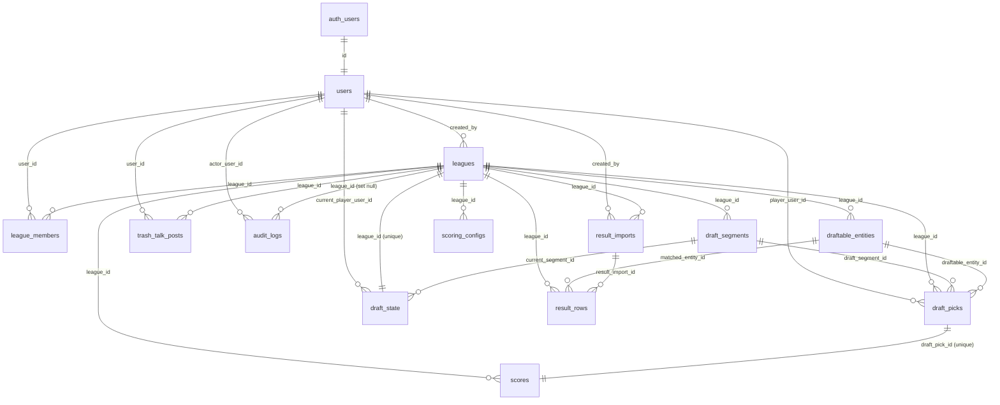

# Database Schema Reference

Authoritative reference for the CFP War Chest Postgres database (Supabase), reconstructed directly from the migration SQL:

- `supabase/migrations/001_initial_schema.sql` — all tables, indexes, RLS policies, triggers, Realtime publication.
- `supabase/migrations/002_seed_data.sql` — seed data (bootstrap admin, 2025 archive league, 2026 sample league).
- `supabase/migrations/003_add_new_categories.sql` — widened category CHECK constraints, `preseason_win_total` column, 2026 sample-league refresh.

All tables live in the `public` schema. Every table has **Row Level Security (RLS) enabled**. The `service_role` key bypasses RLS on nearly every table via a dedicated `*_service_all` policy (server-side admin operations run as service role).

Extensions enabled: `uuid-ossp` (for `uuid_generate_v4()`), `pg_trgm` (trigram matching for fuzzy name resolution).

> **Category values.** Migration 001 defined every category CHECK as `('heisman','cfp','cinderella','conference_champion')`. Migration 003 **widened** the category/`result_type` CHECK on five tables to add `'most_improved'` and `'disaster_draft'`. The tables widened are: `draft_segments`, `draft_picks`, `scoring_configs`, `scores`, `result_imports`. The `result_rows` table has no category column, so it was not touched. `conference_champion` remains a legal value everywhere (retained for the 2025 archive) even though it is disabled for the 2026 sample league.

---

## Table of Contents

- [users](#users)
- [leagues](#leagues)
- [league_members](#league_members)
- [draftable_entities](#draftable_entities)
- [draft_segments](#draft_segments)
- [draft_picks](#draft_picks)
- [draft_state](#draft_state)
- [scoring_configs](#scoring_configs)
- [result_imports](#result_imports)
- [result_rows](#result_rows)
- [scores](#scores)
- [trash_talk_posts](#trash_talk_posts)
- [audit_logs](#audit_logs)
- [Scoring config JSON shapes](#scoring-config-json-shapes)
- [Triggers](#triggers)
- [Realtime](#realtime)
- [ER Diagram](#er-diagram)

---

## users

Profile table extending Supabase `auth.users`.

| Column | Type | Constraints | Default |
|---|---|---|---|
| `id` | uuid | **PK**, FK → `auth.users(id)` ON DELETE CASCADE | — |
| `email` | text | UNIQUE, NOT NULL | — |
| `display_name` | text | NOT NULL | — |
| `role` | text | NOT NULL, CHECK `role in ('admin','player')` | `'player'` |
| `created_at` | timestamptz | NOT NULL | `now()` |

- **Primary key:** `id`
- **Foreign keys:** `id` → `auth.users(id)` (cascade delete)
- **Unique:** `email`
- **CHECK:** `role in ('admin','player')`

**RLS policies:**

| Policy | Command | Rule (plain language) |
|---|---|---|
| `users_own_read` | SELECT | A user may read their own row (`auth.uid() = id`). |
| `users_admin_read` | SELECT | An admin (a `users` row where `id = auth.uid()` and `role = 'admin'`) may read any user row. |
| `users_service_all` | ALL | The `service_role` key may do anything (`auth.role() = 'service_role'`). |

---

## leagues

| Column | Type | Constraints | Default |
|---|---|---|---|
| `id` | uuid | **PK** | `uuid_generate_v4()` |
| `name` | text | NOT NULL | — |
| `season_year` | integer | NOT NULL | — |
| `status` | text | NOT NULL, CHECK (see below) | `'setup'` |
| `settings_json` | jsonb | NOT NULL | `'{}'` |
| `created_by` | uuid | NOT NULL, FK → `users(id)` | — |
| `created_at` | timestamptz | NOT NULL | `now()` |
| `updated_at` | timestamptz | NOT NULL | `now()` (auto-updated by trigger) |

- **Primary key:** `id`
- **Foreign keys:** `created_by` → `users(id)`
- **CHECK:** `status in ('setup','data_imported','draft_ready','drafting','drafted','scoring','completed')`

**`settings_json` shape** (from seed data): `max_players`, `conferences` (string[]), `pick_counts` (per-category int map), `cinderella_ap_threshold`, `draft_timer_enabled`, `draft_timer_seconds`, `draft_timer_on_expiry`, `draft_segment_order` (string[]), `trash_talk_enabled`, `allow_provisional_visibility`, `is_archive`. The `allow_provisional_visibility` boolean gates the provisional-scores RLS policy on `scores`.

**RLS policies:**

| Policy | Command | Rule (plain language) |
|---|---|---|
| `leagues_member_read` | SELECT | A user may read a league if they have a `league_members` row for it (`lm.league_id = id and lm.user_id = auth.uid()`). |
| `leagues_admin_write` | ALL | An admin (global `users.role = 'admin'`) may do anything to any league. |

> Note: `leagues` has no `*_service_all` policy; service-role writes rely on the service key bypassing RLS.

---

## league_members

| Column | Type | Constraints | Default |
|---|---|---|---|
| `id` | uuid | **PK** | `uuid_generate_v4()` |
| `league_id` | uuid | NOT NULL, FK → `leagues(id)` ON DELETE CASCADE | — |
| `user_id` | uuid | NOT NULL, FK → `users(id)` ON DELETE CASCADE | — |
| `display_name` | text | NOT NULL | — |
| `role_in_league` | text | NOT NULL, CHECK `role_in_league in ('admin','player')` | `'player'` |
| `draft_position` | integer | nullable | — |
| `invite_status` | text | NOT NULL, CHECK `invite_status in ('pending','accepted')` | `'pending'` |
| `created_at` | timestamptz | NOT NULL | `now()` |

- **Primary key:** `id`
- **Foreign keys:** `league_id` → `leagues(id)` (cascade), `user_id` → `users(id)` (cascade)
- **Unique:** `(league_id, user_id)`
- **CHECK:** `role_in_league in ('admin','player')`; `invite_status in ('pending','accepted')`

**RLS policies:**

| Policy | Command | Rule (plain language) |
|---|---|---|
| `league_members_read` | SELECT | A user may read membership rows for any league they themselves belong to (self-join on `league_members lm2` matching `league_id` and `auth.uid()`). |
| `league_members_service_all` | ALL | `service_role` may do anything. |
| `league_members_admin_write` | ALL | A global admin may do anything. |

---

## draftable_entities

The pool of draftable athletes and schools per league.

| Column | Type | Constraints | Default |
|---|---|---|---|
| `id` | uuid | **PK** | `uuid_generate_v4()` |
| `league_id` | uuid | NOT NULL, FK → `leagues(id)` ON DELETE CASCADE | — |
| `entity_type` | text | NOT NULL, CHECK `entity_type in ('athlete','school')` | — |
| `athlete_name` | text | nullable | — |
| `school_name` | text | nullable | — |
| `conference` | text | nullable | — |
| `position` | text | nullable | — |
| `preseason_rank` | integer | nullable | — |
| `odds` | integer | nullable | — |
| `odds_source` | text | nullable | — |
| `eligible_categories_json` | jsonb | NOT NULL | `'[]'` |
| `raw_import_json` | jsonb | NOT NULL | `'{}'` |
| `normalized_name` | text | NOT NULL | — |
| `locked` | boolean | NOT NULL | `false` |
| `created_at` | timestamptz | NOT NULL | `now()` |
| `preseason_win_total` | numeric | nullable — **added in migration 003** | — |

- **Primary key:** `id`
- **Foreign keys:** `league_id` → `leagues(id)` (cascade)
- **CHECK:** `entity_type in ('athlete','school')`
- **Indexes:**
  - btree on `(league_id)`
  - **GIN** on `eligible_categories_json` (jsonb containment for category eligibility lookups)
  - btree on `(normalized_name)`

**`preseason_win_total` (migration 003):** Nullable `numeric` holding the locked preseason regular-season win total (the over/under line) used as the **Most Improved baseline**. Nullable because only Most Improved entities carry it; stored as `numeric` because it may be a half-win (e.g. `5.5`). Added via `add column if not exists`. TDD §5 prefers stable fields as first-class columns rather than JSON.

**RLS policies:**

| Policy | Command | Rule (plain language) |
|---|---|---|
| `entities_member_read` | SELECT | A user may read entities for any league they belong to. |
| `entities_admin_write` | ALL | A global admin may do anything. |
| `entities_service_all` | ALL | `service_role` may do anything. |

---

## draft_segments

One row per (league, category) draft segment.

| Column | Type | Constraints | Default |
|---|---|---|---|
| `id` | uuid | **PK** | `uuid_generate_v4()` |
| `league_id` | uuid | NOT NULL, FK → `leagues(id)` ON DELETE CASCADE | — |
| `category` | text | NOT NULL, CHECK (widened in 003) | — |
| `segment_order` | integer | NOT NULL | — |
| `pick_count_per_player` | integer | NOT NULL | `4` |
| `status` | text | NOT NULL, CHECK `status in ('pending','active','completed')` | `'pending'` |

- **Primary key:** `id`
- **Foreign keys:** `league_id` → `leagues(id)` (cascade)
- **Unique:** `(league_id, category)`
- **CHECK (`draft_segments_category_check`, widened in 003):** `category in ('heisman','cfp','cinderella','conference_champion','most_improved','disaster_draft')`
- **CHECK:** `status in ('pending','active','completed')`

**RLS policies:**

| Policy | Command | Rule (plain language) |
|---|---|---|
| `segments_member_read` | SELECT | A user may read segments for any league they belong to. |
| `segments_admin_write` | ALL | A global admin may do anything. |
| `segments_service_all` | ALL | `service_role` may do anything. |

---

## draft_picks

Each individual snake-draft selection.

| Column | Type | Constraints | Default |
|---|---|---|---|
| `id` | uuid | **PK** | `uuid_generate_v4()` |
| `league_id` | uuid | NOT NULL, FK → `leagues(id)` ON DELETE CASCADE | — |
| `draft_segment_id` | uuid | NOT NULL, FK → `draft_segments(id)` | — |
| `round_number` | integer | NOT NULL | — |
| `overall_pick_number` | integer | NOT NULL | — |
| `player_user_id` | uuid | NOT NULL, FK → `users(id)` | — |
| `draftable_entity_id` | uuid | NOT NULL, FK → `draftable_entities(id)` | — |
| `category` | text | NOT NULL, CHECK (widened in 003) | — |
| `locked_odds` | integer | nullable | — |
| `pick_timestamp` | timestamptz | NOT NULL | `now()` |
| `admin_override` | boolean | NOT NULL | `false` |
| `override_reason` | text | nullable | — |

- **Primary key:** `id`
- **Foreign keys:** `league_id` → `leagues(id)` (cascade); `draft_segment_id` → `draft_segments(id)`; `player_user_id` → `users(id)`; `draftable_entity_id` → `draftable_entities(id)`
- **Unique:** `(league_id, overall_pick_number)`
- **CHECK (`draft_picks_category_check`, widened in 003):** `category in ('heisman','cfp','cinderella','conference_champion','most_improved','disaster_draft')`
- **Indexes:** btree on `(league_id)`, `(player_user_id)`, `(draftable_entity_id)`

**RLS policies:**

| Policy | Command | Rule (plain language) |
|---|---|---|
| `picks_member_read` | SELECT | A user may read picks for any league they belong to. |
| `picks_service_all` | ALL | `service_role` may do anything. |

> There is no member/admin *write* policy; picks are written server-side via the service role. (A global admin has no dedicated ALL policy here — admin pick operations go through the service role.)

---

## draft_state

Singleton per league tracking live draft progress (Realtime-published).

| Column | Type | Constraints | Default |
|---|---|---|---|
| `id` | uuid | **PK** | `uuid_generate_v4()` |
| `league_id` | uuid | NOT NULL, **UNIQUE**, FK → `leagues(id)` ON DELETE CASCADE | — |
| `status` | text | NOT NULL, CHECK `status in ('not_started','active','paused','completed')` | `'not_started'` |
| `current_segment_id` | uuid | nullable, FK → `draft_segments(id)` | — |
| `current_overall_pick_number` | integer | NOT NULL | `1` |
| `current_player_user_id` | uuid | nullable, FK → `users(id)` | — |
| `paused` | boolean | NOT NULL | `false` |
| `timer_seconds_remaining` | integer | nullable | — |
| `updated_at` | timestamptz | NOT NULL | `now()` (auto-updated by trigger) |

- **Primary key:** `id`
- **Foreign keys:** `league_id` → `leagues(id)` (cascade); `current_segment_id` → `draft_segments(id)`; `current_player_user_id` → `users(id)`
- **Unique:** `league_id` (enforces one state row per league)
- **CHECK:** `status in ('not_started','active','paused','completed')`

**RLS policies:**

| Policy | Command | Rule (plain language) |
|---|---|---|
| `draft_state_member_read` | SELECT | A user may read the draft state for any league they belong to. |
| `draft_state_service_all` | ALL | `service_role` may do anything. |

---

## scoring_configs

Per-(league, category) scoring configuration driving the scoring engine.

| Column | Type | Constraints | Default |
|---|---|---|---|
| `id` | uuid | **PK** | `uuid_generate_v4()` |
| `league_id` | uuid | NOT NULL, FK → `leagues(id)` ON DELETE CASCADE | — |
| `category` | text | NOT NULL, CHECK (widened in 003) | — |
| `config_json` | jsonb | NOT NULL | — |
| `locked` | boolean | NOT NULL | `false` |
| `created_at` | timestamptz | NOT NULL | `now()` |
| `updated_at` | timestamptz | NOT NULL | `now()` (auto-updated by trigger) |

- **Primary key:** `id`
- **Foreign keys:** `league_id` → `leagues(id)` (cascade)
- **Unique:** `(league_id, category)`
- **CHECK (`scoring_configs_category_check`, widened in 003):** `category in ('heisman','cfp','cinderella','conference_champion','most_improved','disaster_draft')`

See [Scoring config JSON shapes](#scoring-config-json-shapes) for the `config_json` structure of each formula.

**RLS policies:**

| Policy | Command | Rule (plain language) |
|---|---|---|
| `scoring_configs_member_read` | SELECT | A user may read scoring configs for any league they belong to. |
| `scoring_configs_admin_write` | ALL | A global admin may do anything. |
| `scoring_configs_service_all` | ALL | `service_role` may do anything. |

---

## result_imports

An upload batch of end-of-season results awaiting matching/publishing.

| Column | Type | Constraints | Default |
|---|---|---|---|
| `id` | uuid | **PK** | `uuid_generate_v4()` |
| `league_id` | uuid | NOT NULL, FK → `leagues(id)` ON DELETE CASCADE | — |
| `result_type` | text | NOT NULL, CHECK (widened in 003) | — |
| `file_name` | text | NOT NULL | — |
| `status` | text | NOT NULL, CHECK `status in ('pending','reviewing','approved','published')` | `'pending'` |
| `raw_rows_json` | jsonb | NOT NULL | `'[]'` |
| `created_by` | uuid | NOT NULL, FK → `users(id)` | — |
| `created_at` | timestamptz | NOT NULL | `now()` |

- **Primary key:** `id`
- **Foreign keys:** `league_id` → `leagues(id)` (cascade); `created_by` → `users(id)`
- **CHECK (`result_imports_result_type_check`, widened in 003):** `result_type in ('heisman','cfp','cinderella','conference_champion','most_improved','disaster_draft')`
- **CHECK:** `status in ('pending','reviewing','approved','published')`

**RLS policies:**

| Policy | Command | Rule (plain language) |
|---|---|---|
| `result_imports_admin_all` | ALL | A global admin may do anything (no member read — imports are admin-only). |
| `result_imports_service_all` | ALL | `service_role` may do anything. |

---

## result_rows

Individual parsed rows within a result import, with fuzzy-match resolution to an entity.

| Column | Type | Constraints | Default |
|---|---|---|---|
| `id` | uuid | **PK** | `uuid_generate_v4()` |
| `result_import_id` | uuid | NOT NULL, FK → `result_imports(id)` ON DELETE CASCADE | — |
| `league_id` | uuid | NOT NULL, FK → `leagues(id)` ON DELETE CASCADE | — |
| `matched_entity_id` | uuid | nullable, FK → `draftable_entities(id)` | — |
| `raw_row_json` | jsonb | NOT NULL | — |
| `normalized_values_json` | jsonb | NOT NULL | `'{}'` |
| `outcome` | text | nullable | — |
| `match_status` | text | NOT NULL, CHECK `match_status in ('auto','fuzzy','manual','unmatched')` | `'unmatched'` |
| `admin_notes` | text | nullable | — |

- **Primary key:** `id`
- **Foreign keys:** `result_import_id` → `result_imports(id)` (cascade); `league_id` → `leagues(id)` (cascade); `matched_entity_id` → `draftable_entities(id)`
- **CHECK:** `match_status in ('auto','fuzzy','manual','unmatched')`
- **No category column** → not touched by the 003 category widening.

**RLS policies:**

| Policy | Command | Rule (plain language) |
|---|---|---|
| `result_rows_admin_all` | ALL | A global admin may do anything (admin-only table). |
| `result_rows_service_all` | ALL | `service_role` may do anything. |

---

## scores

One published/provisional score per draft pick.

| Column | Type | Constraints | Default |
|---|---|---|---|
| `id` | uuid | **PK** | `uuid_generate_v4()` |
| `league_id` | uuid | NOT NULL, FK → `leagues(id)` ON DELETE CASCADE | — |
| `draft_pick_id` | uuid | NOT NULL, **UNIQUE**, FK → `draft_picks(id)` ON DELETE CASCADE | — |
| `category` | text | NOT NULL, CHECK (widened in 003) | — |
| `outcome` | text | nullable | — |
| `points` | numeric | NOT NULL | `0` |
| `calculation_json` | jsonb | NOT NULL | `'{}'` |
| `published` | boolean | NOT NULL | `false` |
| `created_at` | timestamptz | NOT NULL | `now()` |
| `updated_at` | timestamptz | NOT NULL | `now()` (auto-updated by trigger) |

- **Primary key:** `id`
- **Foreign keys:** `league_id` → `leagues(id)` (cascade); `draft_pick_id` → `draft_picks(id)` (cascade)
- **Unique:** `draft_pick_id` (one score per pick)
- **CHECK (`scores_category_check`, widened in 003):** `category in ('heisman','cfp','cinderella','conference_champion','most_improved','disaster_draft')`
- **Indexes:** btree on `(league_id)`, `(draft_pick_id)`

**RLS policies:**

| Policy | Command | Rule (plain language) |
|---|---|---|
| `scores_member_read_published` | SELECT | A member may read a score if `published = true` **and** they belong to the league. |
| `scores_member_read_provisional` | SELECT | A member may also read a (possibly unpublished) score if they belong to the league **and** that league's `settings_json->>'allow_provisional_visibility'` is `true`. |
| `scores_admin_all` | ALL | A global admin may do anything. |
| `scores_service_all` | ALL | `service_role` may do anything. |

> The two member-read policies are OR-combined (Postgres permissive policies): a member sees a score if it is published, or if provisional visibility is enabled for the league.

---

## trash_talk_posts

League chat/trash-talk feed (Realtime-published).

| Column | Type | Constraints | Default |
|---|---|---|---|
| `id` | uuid | **PK** | `uuid_generate_v4()` |
| `league_id` | uuid | NOT NULL, FK → `leagues(id)` ON DELETE CASCADE | — |
| `user_id` | uuid | NOT NULL, FK → `users(id)` | — |
| `body` | text | NOT NULL, CHECK `length(body) <= 500` | — |
| `deleted` | boolean | NOT NULL | `false` |
| `created_at` | timestamptz | NOT NULL | `now()` |
| `updated_at` | timestamptz | NOT NULL | `now()` (auto-updated by trigger) |

- **Primary key:** `id`
- **Foreign keys:** `league_id` → `leagues(id)` (cascade); `user_id` → `users(id)`
- **CHECK:** `length(body) <= 500`
- **Index:** btree on `(league_id, created_at desc)`

**RLS policies:**

| Policy | Command | Rule (plain language) |
|---|---|---|
| `trash_talk_member_read` | SELECT | A member of the league may read a post if `deleted = false`. |
| `trash_talk_own_insert` | INSERT (WITH CHECK) | A user may insert a post only as themselves (`user_id = auth.uid()`) and only into a league they belong to. |
| `trash_talk_own_delete` | UPDATE (USING) | A user may update (used for soft-delete) only their own posts (`user_id = auth.uid()`). |
| `trash_talk_admin_all` | ALL | A global admin may do anything. |
| `trash_talk_service_all` | ALL | `service_role` may do anything. |

---

## audit_logs

Append-only audit trail of admin/system actions.

| Column | Type | Constraints | Default |
|---|---|---|---|
| `id` | uuid | **PK** | `uuid_generate_v4()` |
| `league_id` | uuid | nullable, FK → `leagues(id)` ON DELETE SET NULL | — |
| `actor_user_id` | uuid | NOT NULL, FK → `users(id)` | — |
| `action` | text | NOT NULL | — |
| `entity_type` | text | NOT NULL | — |
| `entity_id` | text | NOT NULL | — |
| `before_json` | jsonb | nullable | — |
| `after_json` | jsonb | nullable | — |
| `created_at` | timestamptz | NOT NULL | `now()` |

- **Primary key:** `id`
- **Foreign keys:** `league_id` → `leagues(id)` **ON DELETE SET NULL** (log survives league deletion); `actor_user_id` → `users(id)`
- **Index:** btree on `(league_id, created_at desc)`

**RLS policies:**

| Policy | Command | Rule (plain language) |
|---|---|---|
| `audit_logs_admin_read` | SELECT | A global admin may read audit logs. |
| `audit_logs_service_all` | ALL | `service_role` may do anything (writes are service-role only). |

---

## Scoring config JSON shapes

`scoring_configs.config_json` is a per-category JSON document. Its `formula` field selects the scoring engine branch; the remaining fields parameterize that formula. Shapes below are drawn from the seed data (002) and the new-category seed (003).

### `multiplier_odds_ratio`
Used by **heisman**, **cfp**, and **conference_champion**. Score = the matched outcome's `multiplier` applied to the pick's locked odds ratio. Outcomes are keyed by outcome name; each maps to `{ "multiplier": <number> }`.

```json
{
  "formula": "multiplier_odds_ratio",
  "outcomes": {
    "winner":              { "multiplier": 350 },
    "finalist_non_winner": { "multiplier": 100 },
    "no_score":            { "multiplier": 0 }
  }
}
```

- **heisman** outcomes: `winner` (350), `finalist_non_winner` (100), `no_score` (0).
- **cfp** outcomes: `wins_national_title` (300), `loses_final` (200), `loses_semifinal` (100), `makes_playoff_no_semifinal` (20), `misses_playoff` (0).
- **conference_champion** outcomes (2025 archive only): `wins_conference_title_game` (150), `loses_conference_title_game` (75), `fails_to_qualify` (0).

### `fixed_points`
Used by **cinderella**. Score = flat `points` for the matched outcome (no odds involved). Outcomes map to `{ "points": <number> }`.

```json
{
  "formula": "fixed_points",
  "outcomes": {
    "top_10":    { "points": 150 },
    "rank_11_20":{ "points": 75 },
    "rank_21_25":{ "points": 40 },
    "unranked":  { "points": 0 }
  }
}
```

### `wins_over_baseline`
Used by **most_improved** (added in 003). Score = `points_per_win` × (actual regular-season wins − the entity's locked `preseason_win_total` baseline), clamped between `floor` and `cap`.

```json
{
  "formula": "wins_over_baseline",
  "points_per_win": 25,
  "floor": 0,
  "cap": 250
}
```

### `inverted_record`
Used by **disaster_draft** (added in 003). Rewards losing: `points_per_loss` per loss, `points_per_win` (negative) per win, plus a `winless_bonus` if the entity finishes without a win. Clamped between `floor` and `cap` (here `cap` is `null` = uncapped).

```json
{
  "formula": "inverted_record",
  "points_per_loss": 20,
  "points_per_win": -20,
  "winless_bonus": 200,
  "floor": 0,
  "cap": null
}
```

---

## Triggers

A shared `update_updated_at()` PL/pgSQL function sets `NEW.updated_at = now()` on update. It is attached `BEFORE UPDATE FOR EACH ROW` to:

- `leagues` (`leagues_updated_at`)
- `scoring_configs` (`scoring_configs_updated_at`)
- `scores` (`scores_updated_at`)
- `trash_talk_posts` (`trash_talk_updated_at`)
- `draft_state` (`draft_state_updated_at`)

---

## Realtime

The `supabase_realtime` publication includes (for Change Data Capture / live UI):

- `draft_state`
- `draft_picks`
- `trash_talk_posts`

---

## ER Diagram



> Relationship notes: `draft_state` ↔ `leagues` and `scores` ↔ `draft_picks` are one-to-one (enforced by UNIQUE on the FK column). `audit_logs.league_id` is nullable with ON DELETE SET NULL, so audit rows outlive their league. `users.id` is a 1:1 extension of Supabase's `auth.users`.
